# RecruitAI — Architecture

This document explains how the entire system fits together — from a user clicking "Score Candidates" to a ranked list appearing on screen.

---

## System Overview

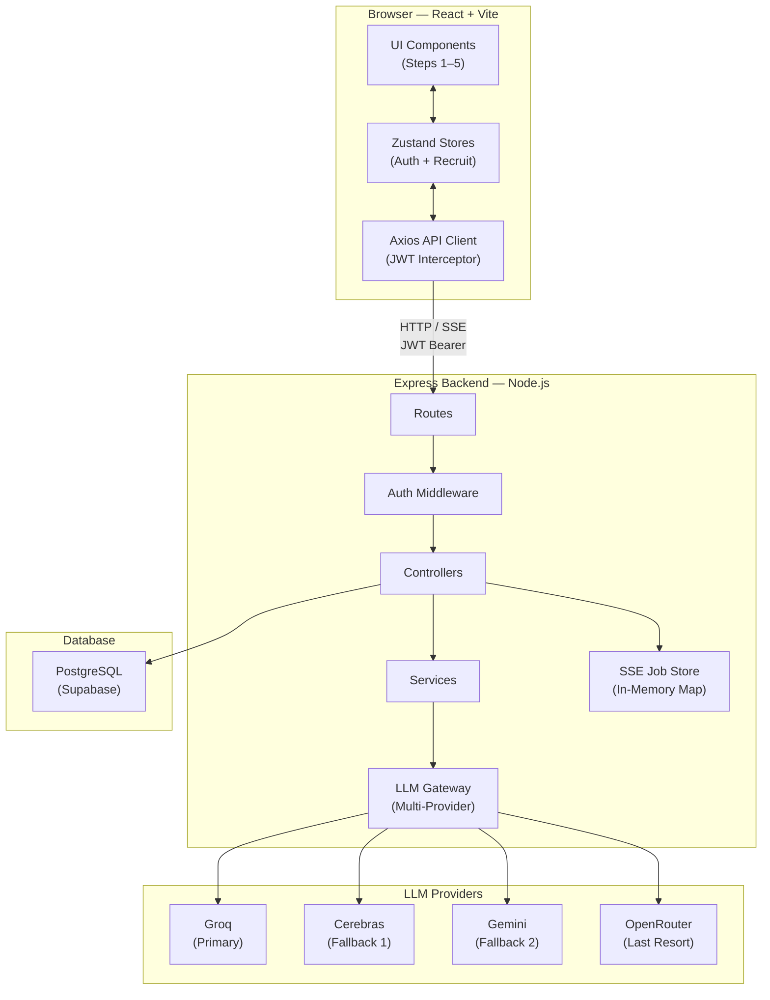

---

## Request Lifecycle

Every API request follows a consistent path through the backend:

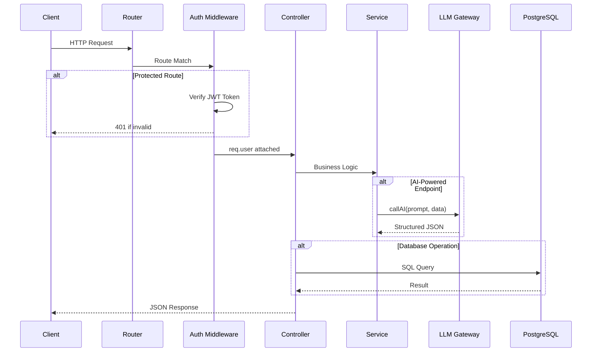

---

## Data Flow — Step by Step

### Authentication Flow

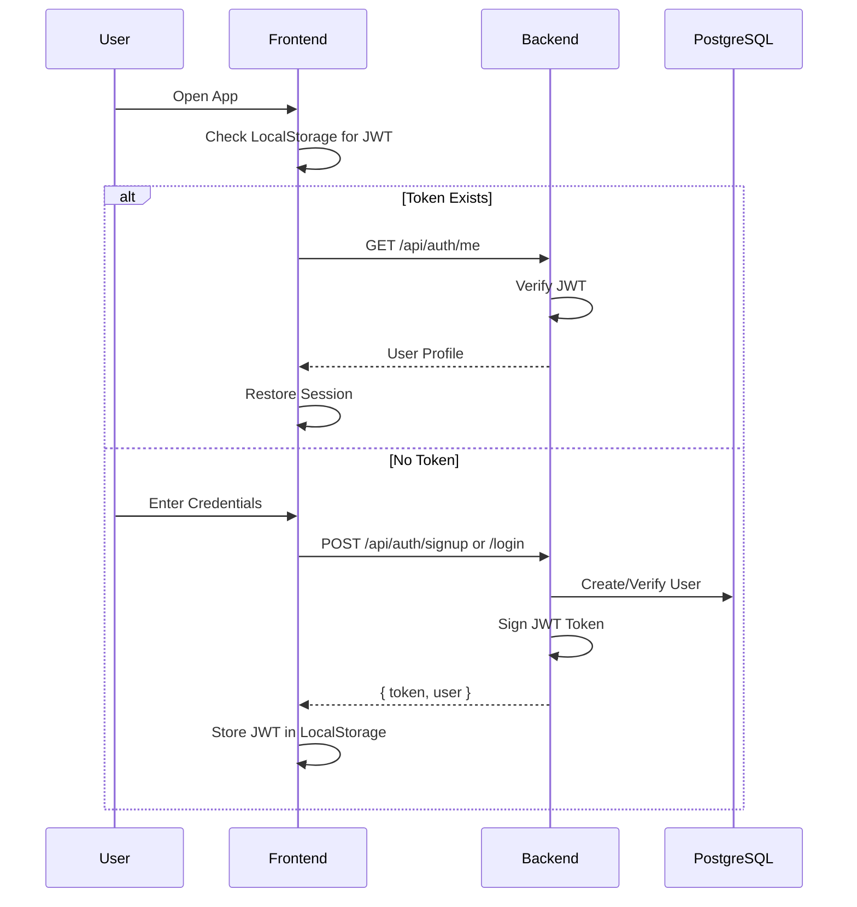

---

### Step 1 — Parse Job Description

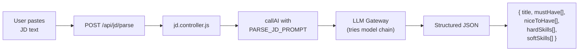

**Output**: Structured job requirements stored in Zustand `parsedJD`.

---

### Step 2 — Upload & Parse CVs

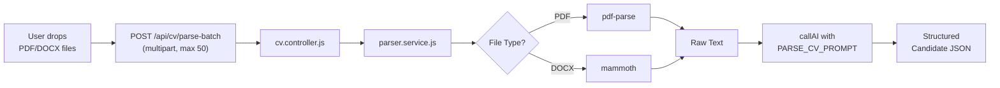

**Output**: Array of `{ filename, parsed: { name, skills[], workHistory[] }, status }`.

---

### Step 3 — Score & Rank (SSE Pipeline)

This is the most complex flow — it uses **Server-Sent Events** for real-time progress reporting.

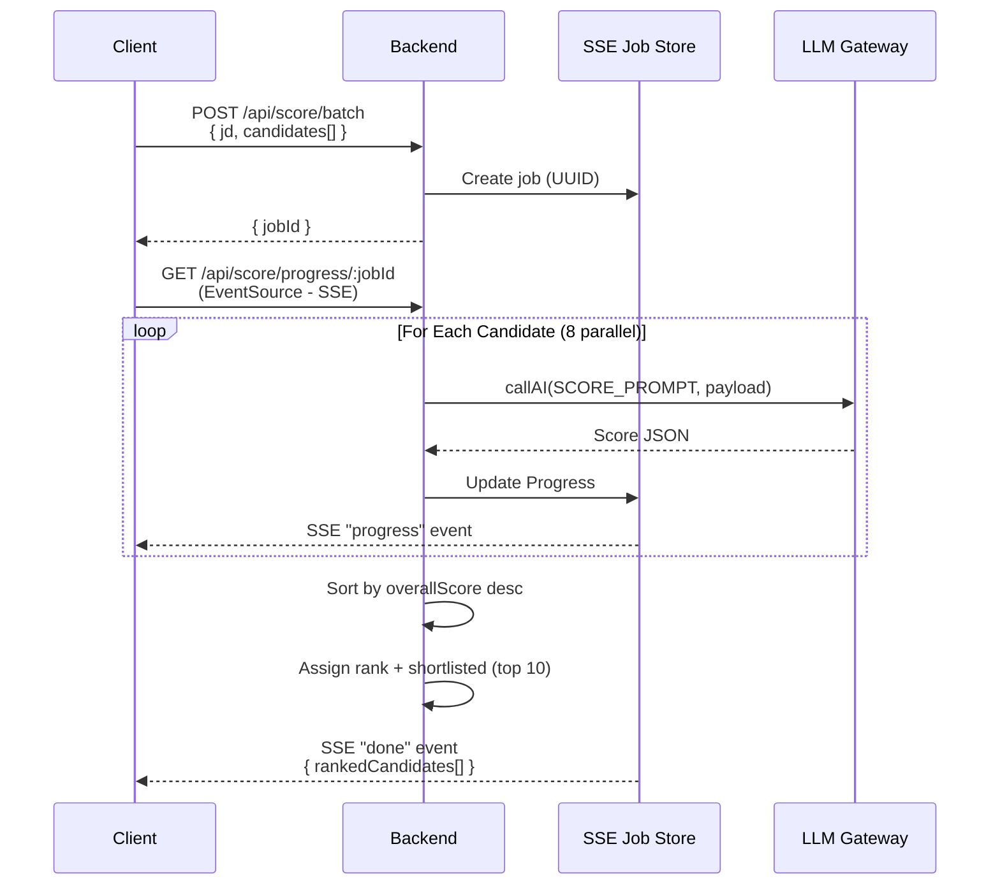

**Scoring Dimensions** (5 categories):

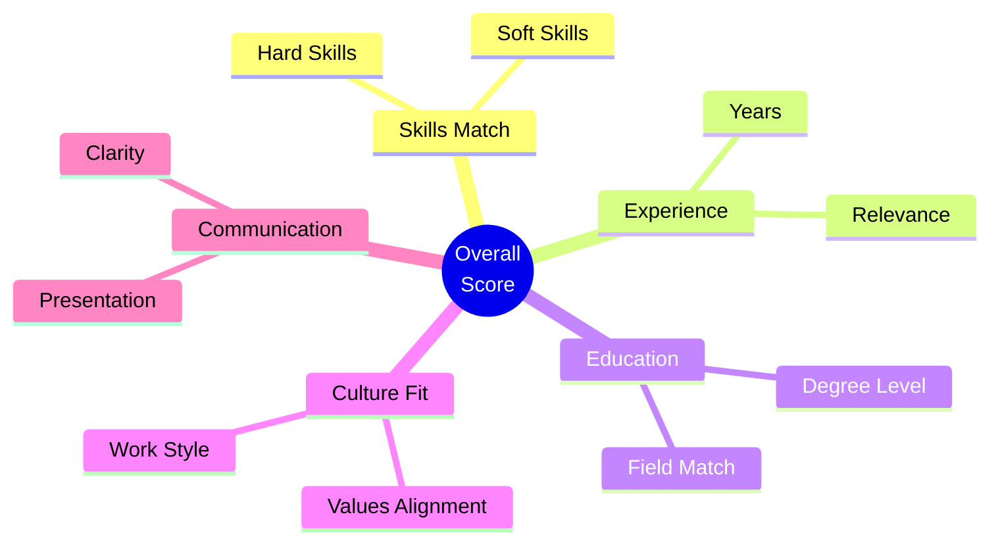

---

### Step 4 — Bias Detection (Auto-triggered)

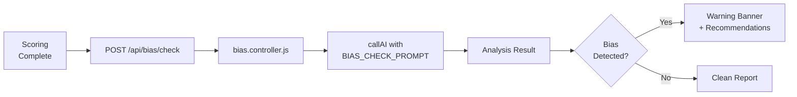

**Output**: `{ biasDetected, biasTypes[], affectedGroups[], recommendation }`.

---

### Step 5 — Interview Guide Generation

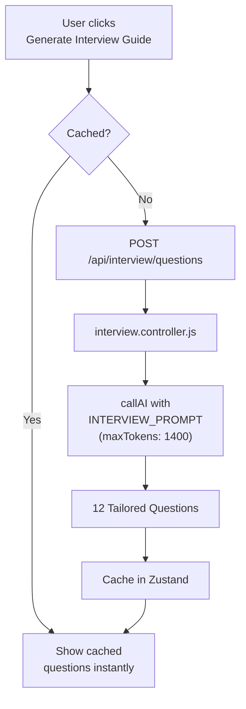

**Question Categories**:

| Category | Count | Purpose |
|:---------|:-----:|:--------|
| Technical | 3 | Validate hard skills and domain knowledge |
| Behavioral | 3 | Assess soft skills and past performance |
| Gap-Probing | 3 | Explore weaknesses identified in scoring |
| Culture Fit | 3 | Evaluate values alignment and work style |

---

## AI Layer — Multi-Provider Gateway

All AI requests route through `llm.service.js`, which implements a resilient multi-provider gateway with automatic key rotation and cascading fallbacks:

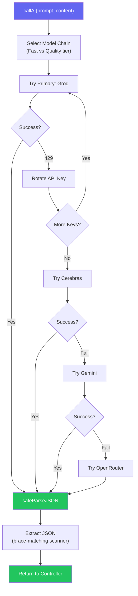

### Model Tiers

| Tier | Use Case | Models | Rationale |
|:-----|:---------|:-------|:----------|
| **Fast** | JD/CV parsing | `llama-3.1-8b-instant` | Cheaper, lower latency for simpler extraction |
| **Quality** | Scoring, Bias, Interviews | `llama-3.3-70b-versatile`, `gpt-oss-120b` | Better reasoning for nuanced evaluation |

### Key Routing Principles

1. **Tier Isolation** — Fast and Quality tiers use different models on Groq. Since rate limits are per-model, this effectively doubles concurrent capacity.
2. **Instant Rotation on 429** — Comma-separated API keys (`GROQ_API_KEY=key1,key2`) are rotated automatically when rate limits are hit.
3. **Resilient JSON Parser** — The brace-matching scanner extracts valid JSON even when models output reasoning tokens or conversational filler before the payload.

---

## Backend Architecture

### Layer Diagram

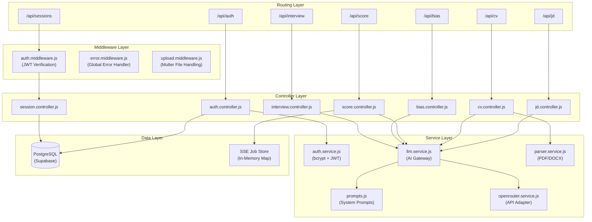

### Route Mapping

| Route | Controller | Auth | Description |
|:------|:-----------|:----:|:------------|
| `/api/auth` | `auth.controller.js` | — | User registration and login |
| `/api/jd` | `jd.controller.js` | — | Job description parsing |
| `/api/cv` | `cv.controller.js` | — | CV batch upload and parsing |
| `/api/score` | `score.controller.js` | — | Batch scoring + SSE progress |
| `/api/bias` | `bias.controller.js` | — | Shortlist bias analysis |
| `/api/interview` | `interview.controller.js` | — | Interview guide generation |
| `/api/sessions` | `session.controller.js` | 🔒 | Screening session CRUD |

---

## Database Schema

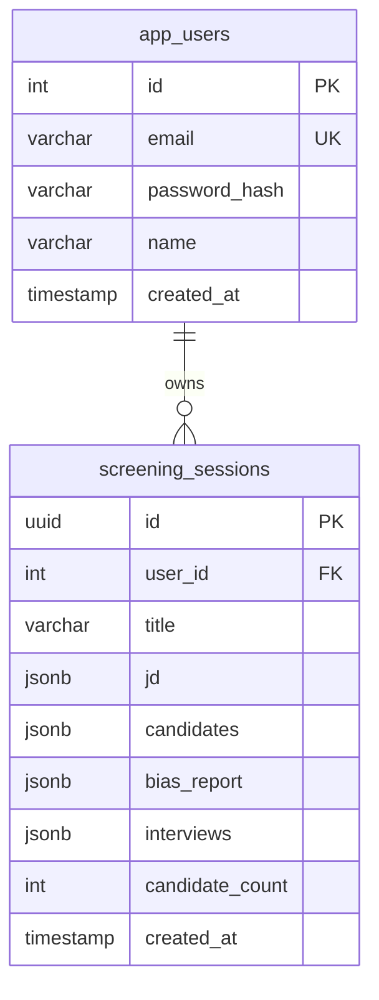

- **`app_users`**: Stores registered users with bcrypt-hashed passwords
- **`screening_sessions`**: Persists complete screening sessions (JD, candidates, scores, bias reports, interview guides) as JSONB for flexible schema

---

## Frontend Architecture

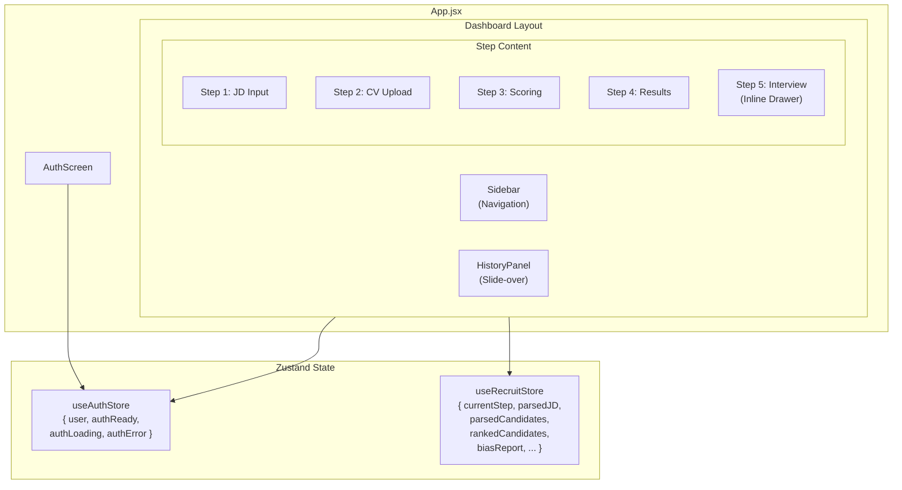

### State Stores

#### `useAuthStore`

| Property | Type | Purpose |
|:---------|:-----|:--------|
| `user` | `Object` | Logged-in user info `{ id, email, name }` |
| `authReady` | `boolean` | LocalStorage JWT checked on boot |
| `authLoading` | `boolean` | Signup/login in progress |
| `authError` | `string` | Active auth error message |

#### `useRecruitStore`

| Property | Type | Purpose |
|:---------|:-----|:--------|
| `currentStep` | `number` | Active workflow step (1–4) |
| `parsedJD` | `Object` | Structured JD from AI |
| `parsedCandidates` | `Array` | Parsed candidate list |
| `isScoringActive` | `boolean` | SSE stream is active |
| `scoringProgress` | `number` | Progress percentage (0–100) |
| `rankedCandidates` | `Array` | Scored & sorted candidates |
| `biasReport` | `Object` | Shortlist bias analysis |
| `interviewQuestions` | `Object` | Cached guides by candidate name |
| `savedSessions` | `Array` | Past screening metadata |

---

## Key Design Decisions

| Decision | Rationale |
|:---------|:----------|
| **SSE over WebSockets** | Simpler server-side; unidirectional push is all scoring progress needs |
| **In-Memory Job Store** | Keeps SSE streaming fast without DB overhead; auto-saves to DB when scoring finishes |
| **PostgreSQL Session History** | Restoring past screenings solves state loss on restarts, enabling production use |
| **Multi-Provider LLM Fallback** | Ensures availability even when individual free-tier APIs go down |
| **API Key Pool Rotation** | Distributes load evenly, avoiding early rate-limit exhaustion |
| **Brace-Matching JSON Extractor** | Handles reasoning tokens and filler printed by models before JSON output |
| **Stateless JWT Auth** | Eliminates session-store DB queries, keeping routing fast and stateless |
| **Dual Zustand Stores** | Separates auth state from screening state for clean, focused modules |
| **Interview Question Cache** | Prevents redundant API calls when reopening candidate profiles |
| **Tier-Based Model Selection** | Fast tier for parsing, quality tier for scoring — maximizes throughput |
