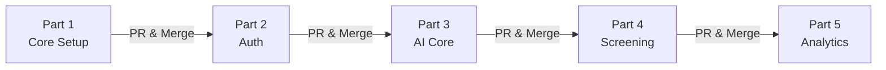

<p align="center">
  
  
  
  
</p>

# RecruitAI — AI-Augmented Recruitment Platform

> An end-to-end AI-powered screening pipeline: paste a job description, upload CVs, watch candidates scored and ranked in real time, detect shortlist bias, and generate tailored interview guides — all in a single flow.

---

## ✨ Features

| Feature | Description |
|:--------|:------------|
| **JD Parsing** | AI extracts must-haves, nice-to-haves, skills, and experience level from any job description |
| **CV Batch Parsing** | Upload up to 50 PDF/DOCX CVs; text is extracted with `pdf-parse` + `mammoth`, then AI-structured |
| **AI Scoring & Ranking** | Each candidate is scored across 5 dimensions with a live SSE progress stream |
| **Bias Detection** | AI audits the shortlist for gender, ethnicity, age, disability, and geography bias |
| **Interview Guide** | Generates 12 tailored questions per candidate (Technical, Behavioral, Gap-Probing, Culture) |
| **Session History** | Save, restore, and manage past screening sessions in Supabase PostgreSQL |
| **Demo Mode** | Full demo with 15 realistic candidates and a fintech JD — no file uploads needed |

---

## 🏗️ Tech Stack

| Layer | Technology |
|:------|:-----------|
| **Runtime** | Node.js 18+ · ES Modules |
| **Framework** | Express 4 with `express-async-errors` |
| **Database** | PostgreSQL via Supabase (Supavisor connection pooler) |
| **AI Gateway** | Multi-provider LLM gateway with key rotation & cascading fallbacks |
| **LLM Providers** | Groq · Cerebras · Google Gemini · OpenRouter |
| **Authentication** | Stateless JWT with bcrypt password hashing |
| **CV Parsing** | `pdf-parse` (PDFs) · `mammoth` (DOCX) |
| **Real-time** | Server-Sent Events (SSE) for live scoring progress |
| **Security** | Helmet · CORS · Morgan logging |

---

## 🚀 Quick Start

### Prerequisites

- **Node.js 18+**
- At least **one LLM API key** (Groq, Cerebras, Gemini, or OpenRouter)
- A **PostgreSQL database** (free tier on [Supabase](https://supabase.com))

### 1. Clone & Install

```bash
git clone https://github.com/MohitSAGAR11/Recruitor-AI.git
cd Recruitor-AI

# Install backend dependencies
cd backend && npm install
```

### 2. Configure Environment

```bash
cp .env.example .env
```

Edit `.env` with your credentials:

```env
# Database & Auth
DATABASE_URL=postgresql://postgres:...    # Supabase Postgres connection string
JWT_SECRET=your-secure-random-string      # Secret for signing JWT tokens

# LLM Providers (comma-separate keys for pool rotation)
GROQ_API_KEY=gsk_...
CEREBRAS_API_KEY=csk_...
GEMINI_API_KEY=AIzaSy...
OPENROUTER_API_KEY=sk-or-...

# Server
PORT=3024
CORS_ORIGIN=http://localhost:5173
MAX_CONCURRENT_AI_CALLS=8
AI_CALL_TIMEOUT_MS=45000
```

### 3. Set Up Database

Run the following SQL in your Supabase SQL Editor:

```sql
CREATE TABLE app_users (
    id SERIAL PRIMARY KEY,
    email VARCHAR(255) UNIQUE NOT NULL,
    password_hash VARCHAR(255) NOT NULL,
    name VARCHAR(255),
    created_at TIMESTAMP WITH TIME ZONE DEFAULT CURRENT_TIMESTAMP
);

CREATE TABLE screening_sessions (
    id UUID PRIMARY KEY DEFAULT gen_random_uuid(),
    user_id INTEGER NOT NULL REFERENCES app_users(id) ON DELETE CASCADE,
    title VARCHAR(255) NOT NULL,
    jd JSONB NOT NULL,
    candidates JSONB NOT NULL,
    bias_report JSONB,
    interviews JSONB DEFAULT '{}'::jsonb,
    candidate_count INTEGER NOT NULL,
    created_at TIMESTAMP WITH TIME ZONE DEFAULT CURRENT_TIMESTAMP
);
```

### 4. Run the Server

```bash
npm run dev
# → Server starts at http://localhost:3024
```

You should see:

```
RecruitAI backend running on port 3024
   LLM providers active: Groq(1 key) → Cerebras(1) → Gemini
   Database: connected (Supabase Postgres)
   DB ping: reachable
```

---

## 🌐 API Reference

| Method | Route | Description | Auth |
|:-------|:------|:------------|:----:|
| `GET` | `/api/health` | Health check | — |
| `POST` | `/api/auth/signup` | Register a new user | — |
| `POST` | `/api/auth/login` | Log in and receive JWT | — |
| `GET` | `/api/auth/me` | Get current user profile | 🔒 |
| `POST` | `/api/jd/parse` | Parse job description text/file | — |
| `POST` | `/api/cv/parse-batch` | Batch parse CVs (PDF/DOCX, max 50) | — |
| `POST` | `/api/score/batch` | Start async scoring job → `{ jobId }` | — |
| `GET` | `/api/score/progress/:jobId` | SSE stream: progress + ranked results | — |
| `POST` | `/api/bias/check` | Bias analysis on shortlisted candidates | — |
| `POST` | `/api/interview/questions` | Generate tailored interview questions | — |
| `GET` | `/api/sessions` | List past screening sessions | 🔒 |
| `POST` | `/api/sessions` | Save a screening session | 🔒 |
| `GET` | `/api/sessions/:id` | Retrieve session details | 🔒 |
| `PATCH` | `/api/sessions/:id/interviews` | Update interview guide | 🔒 |
| `DELETE` | `/api/sessions/:id` | Delete a session | 🔒 |

---

## 📁 Project Structure

```
Recruitor-AI/
└── backend/
    ├── config/
    │   └── env.js                  # Centralized env loading & LLM key pool config
    ├── controllers/
    │   ├── auth.controller.js      # Signup, login, profile
    │   ├── jd.controller.js        # Job description parsing
    │   ├── cv.controller.js        # CV batch parsing
    │   ├── score.controller.js     # AI scoring with SSE progress
    │   ├── bias.controller.js      # Shortlist bias detection
    │   ├── interview.controller.js # Interview guide generation
    │   └── session.controller.js   # Screening session CRUD
    ├── db/
    │   └── pool.js                 # Postgres connection pool (Supabase)
    ├── middleware/
    │   ├── auth.middleware.js       # JWT token verification
    │   ├── error.middleware.js      # Global error handler
    │   └── upload.middleware.js     # Multer file upload config
    ├── routes/
    │   ├── auth.routes.js          # /api/auth/*
    │   ├── jd.routes.js            # /api/jd/*
    │   ├── cv.routes.js            # /api/cv/*
    │   ├── score.routes.js         # /api/score/*
    │   ├── bias.routes.js          # /api/bias/*
    │   ├── interview.routes.js     # /api/interview/*
    │   └── session.routes.js       # /api/sessions/*
    ├── services/
    │   ├── auth.service.js         # Password hashing & JWT signing
    │   ├── llm.service.js          # Multi-provider LLM gateway
    │   ├── openrouter.service.js   # OpenRouter API integration
    │   ├── parser.service.js       # PDF/DOCX text extraction
    │   └── prompts.js              # All LLM system prompts
    ├── package.json
    ├── .env.example
    ├── .gitignore
    └── server.js                   # Express app entry point
```

See [ARCHITECTURE.md](./ARCHITECTURE.md) for a deep-dive into how each layer connects.

---

## ⚙️ Environment Variables

| Variable | Required | Description |
|:---------|:--------:|:------------|
| `DATABASE_URL` | Yes | PostgreSQL connection string (Supabase) |
| `JWT_SECRET` | Yes | Secret key for signing JWT tokens |
| `GROQ_API_KEY` | Recommended | Primary LLM provider (supports comma-separated key pools) |
| `CEREBRAS_API_KEY` | Optional | Failover LLM provider |
| `GEMINI_API_KEY` | Optional | Must start with `AIza` for free API quota |
| `OPENROUTER_API_KEY` | Optional | Last-resort fallback provider |
| `PORT` | No | Server port (default: `3024`) |
| `CORS_ORIGIN` | No | Allowed frontend origin (default: Netlify deploy URL) |
| `MAX_CONCURRENT_AI_CALLS` | No | Parallel AI requests during scoring (default: `8`) |
| `AI_CALL_TIMEOUT_MS` | No | Per-request timeout in ms (default: `45000`) |

> **Tip:** Pass multiple API keys as comma-separated values (e.g., `GROQ_API_KEY=key1,key2,key3`) to enable automatic key rotation and load spreading across rate-limit pools.

---

## 👥 Team & Contribution Strategy

This backend is built collaboratively in **5 sequential parts**, each merged via Pull Request:



| Part | Phase | Key Deliverable |
|:-----|:------|:----------------|
| **1** | Base Infrastructure | Express server, database pool, error middleware |
| **2** | Access Management | JWT auth, signup/login, route guards |
| **3** | AI Integration | Multi-provider LLM gateway, file parsers, prompts |
| **4** | Screening Pipeline | JD/CV parsing, batch scoring with SSE progress |
| **5** | Analytics & History | Bias detection, interview guides, session persistence |

---

## 📝 Notes

- **Multi-Provider Fallback**: If the primary model returns `429` (rate limited), the gateway automatically tries the next provider in the chain
- **Key Rotation**: Comma-separated keys are rotated automatically to spread load across separate quota pools
- **Scoring Parallelism**: Candidates are scored concurrently using `p-limit(8)` for fastest batch completion
- **Token Optimization**: Scoring uses slim payloads with `max_tokens: 600`; interview generation uses `max_tokens: 1400`
- **SSE Job Store**: In-memory — don't restart the backend mid-scoring
- **Image PDFs**: PDFs with <100 extracted characters return a warning to paste text manually

